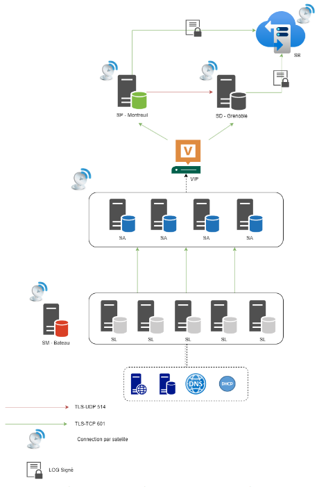
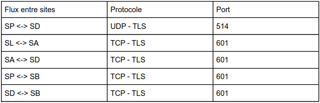
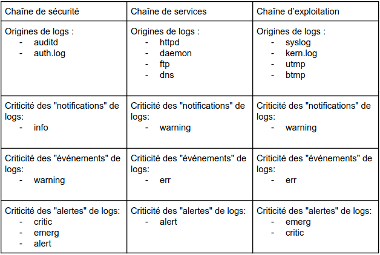

# **Architecture de notre système de journalisation**

## **Presentation**

Ce document représente l’architecture de système de journalisation qui permet d’avoir une vue globale de la solution proposée sur votre réseau.

## **Documentation**

Ce système permet de collecter les journaux de différents services de sites locaux (SA) qui seront transmis au site principal (SP) en passant par les sites de relais (SA). Cette transmission de flux sera faite de manière fiable et sécurisée.

Définition des différents sites :

- SL : Site local qui contient les différentes sources de journaux.
- SA : Site autonome ou plutôt relais, qui permet de transmettre les informations de SL vers le SP.
- SP : Site principal, représente le centre d’enregistrement et de corrélations de logs.
- SB : Site de backup, un serveur de backup qui contient tous les logs signés et contrôlés reçu par le SP.
- SD : Site de dévolution , qui prend en charge la réception de logs en cas d'indisponibilité du site principal.
- SM : Site mobile, transmet de logs au SP par la connexion satellite.

### **Description de flux du système de journalisation entre les sites**

Tout d’abord, les communications entre sites se feront sur le port 601 en utilisant le protocole TCP tout en étant chiffré par le protocole TLS. Nous avons décidé de choisir cette solution de communication afin de pouvoir sécuriser la circulation des flux et aussi de contrôler les remontées de flux plus précisément ici les LOGS.

Cependant entre les sites SP <-> SD on utilise le protocole UDP sur le port 514 car on n’a pas besoin de contrôler les flux entre ces deux sites. En effet, étant donné que ce site est un site de dévolution, effectivement, en cas d’urgence il va remplacer le SP, il n’y a donc pas besoin de contrôler les flux entre SP et SD cependant la communication des flux sera chiffrée via le protocole TLS.

De plus, les communications des flux entre SA et SP/SD seront faites par un VIP ( Virtual IP Address) qui va rediriger les flux vers le SD si le SP tombe.

Ensuite, les LOG qui transitent entre SP et SB et SD et SB seront signés et contrôlés.

Enfin, les sites mobiles (SM) utilisent une communication par satellite, principalement SP et SA si le site mobile en question est proche. Cependant, si SP tombe, il cherchera à se connecter vers SD

## **Définition de types de Logs**

Logiciel à utiliser : **Rsyslog - Linux**
Voici les exemples types de logs que nous devons récupérer :

- auditd
- windows security logs
- auth.log
- syslog
- httpd/access_log - service http
- kern.log
- cron

Ainsi on peut déduire ce tableau de définitions des chaînes :

**Remarque : Tous les logs ne seront pas conservés pendant 7 ans mais plutôt de 6 mois à 1 ans selon les recommandations du CNI. En effet, il est inutile de tout conserver pendant 7 ans car cela saturera le stockage des systèmes.**
