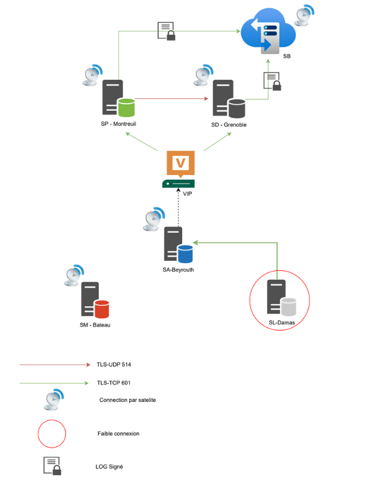
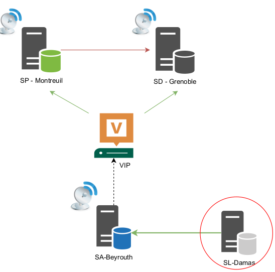

# **Proof of Concept**

## **Notre choix de cette simulation POC**

Voici la solution que nous avons décider de simuler :

Nous avons choisi cette architecture car elle rassemble en global les problèmes à traiter.

Tout d'abord, on choisit de simuler SP, SD et SB car se sont les serveurs les plus important de votre achitecture réseau. Cela nous permettre de simuler la rédirection des flux vers SD lorsque le SP est down. De plus, cela permettra de simuler le SB qui backup tous les LOGS depuis SP et SD avec des paquets archivés et signés.

Ensuite, nous avons choisit un seul SA ( SA-Beyrouth ) car la configuration de ce serveur autonome car la configuration de ce serveur qui fait office de serveur relay sera le même principe que les autres SA.

Puis nous avons choisi un SL, plus précisément le SL-Dama afin de simuler en temps réel la communication de flux à faible conexion de SA Beyrouth et SL-Damas.

Enfin, nous choisissons de simuler un SM, plus précisement le bateau car c'est un site mobile qui communique part liaison satélite vers SP.

## **Réalisation de la simulation**

### **Les problèmes rencontrés**

Pendant la simulation du POC, nous somme apperçu que la solution Rsyslog ne pas fonctionner en tant que serveur et client en même temps. En effet, ici, SA-Beyrouth est le client de SP-Montreuil, il ne peut donc qu'envoyer des LOGS et donc de ne pas recevoir des LOGS de la part de SL-Damas.

### **Résolution des problèmes rencontrés**

Pour palier à ce problème, nous avons décider de faire fonctionner SL-Damas en tant que serveur Rsylog afin qu'il traite ces LOGS en local en paquet Rsyslog.
Puis nous envoyont ces paquets via un connexion SSH vers SA-Beyrouth afin qu'il transmet ses LOGS et les LOGS de SL-Damas vers SP-MOntreuil ou SD-Grenoble si SP-MOntreuil est down.
